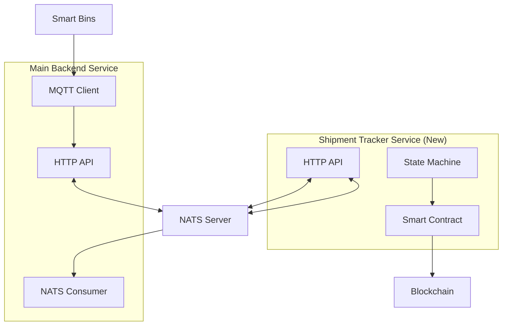

# Smart Waste Management Backend

A robust Golang backend system for an AI & AR-Driven Smart Waste Management Platform with IoT integration, REST APIs, and containerized deployment.

## Features

- **IoT Integration**: MQTT client for real-time data from ESP32-based smart bins
- **REST API**: Comprehensive endpoints for users, drivers, bins, companies, and analytics
- **Business Logic**:
  - Automated driver notification when bin fill-level exceeds 90%
  - Valuation engine for AI-detected waste metadata
  - Route optimization with Google Maps/OSRM integration
- **Analytics Dashboard**: Collection statistics, driver performance, and bin metrics
- **Docker Support**: Production-ready containerized deployment

## Architecture



## Tech Stack

- **Language**: Go 1.21+
- **Framework**: Gin (HTTP web framework)
- **Database**: PostgreSQL 15
- **Message Brokers**:
  - Eclipse Mosquitto (MQTT) for IoT
  - NATS JetStream for Microservices
- **Blockchain**: Ethereum/Polygon (via Shipment Tracker)
- **Containerization**: Docker & Docker Compose

## Quick Start

### Prerequisites

- Docker & Docker Compose
- Go 1.21+ (for local development)
- TinyGo (optional, for IoT hardware deployment)

### IoT Sensor Service

The `iot_sensor` directory contains code for smart waste bins, designed to run on Raspberry Pi (using TinyGo) or as a simulator on any machine.

**Run Simulation (Mac/Linux):**
```bash
cd iot_sensor
go run cmd/device/main.go
# This simulates a bin sensor publishing fill levels to MQTT
```

**Deploy to Raspberry Pi (TinyGo):**
```bash
tinygo flash -target=raspberrypi cmd/device/main.go
```

### Run with Docker

```bash
# Navigate to the project root
cd /Users/macos/Desktop/waste_backend

# Copy environment template (if needed, or create .env based on examples)
# cp go_backend/.env.example .env (adjust as needed)

# Start all services (Backend, Shipment Tracker, MQTT, NATS, Postgres, IoT Simulator)
docker-compose up --build

# With Adminer (database UI)
docker-compose --profile tools up --build
```

### Access Points

| Service | URL |
|---------|-----|
| API | http://localhost:8080 |
| Health Check | http://localhost:8080/health |
| MQTT Broker | localhost:1883 |
| Adminer (optional) | http://localhost:8081 |

### Run Locally (Development)

```bash
# Start dependencies
docker-compose up postgres mosquitto -d

# Run the API
go run cmd/server/main.go
```

## API Endpoints

### Users
| Method | Endpoint | Description |
|--------|----------|-------------|
| GET | `/api/v1/users` | List users |
| POST | `/api/v1/users` | Create user |
| GET | `/api/v1/users/:id` | Get user |
| PUT | `/api/v1/users/:id` | Update user |
| DELETE | `/api/v1/users/:id` | Delete user |
| GET | `/api/v1/users/:id/rewards` | Get reward points |
| POST | `/api/v1/users/:id/rewards` | Add reward points |

### Drivers
| Method | Endpoint | Description |
|--------|----------|-------------|
| GET | `/api/v1/drivers` | List drivers |
| POST | `/api/v1/drivers` | Create driver |
| GET | `/api/v1/drivers/:id` | Get driver |
| PUT | `/api/v1/drivers/:id` | Update driver |
| PUT | `/api/v1/drivers/:id/location` | Update location |
| GET | `/api/v1/drivers/:id/routes` | Get optimized routes |
| POST | `/api/v1/drivers/:id/verify` | Verify task (QR) |
| GET | `/api/v1/drivers/:id/stats` | Get performance stats |

### Bins
| Method | Endpoint | Description |
|--------|----------|-------------|
| GET | `/api/v1/bins` | List bins |
| POST | `/api/v1/bins` | Register bin |
| GET | `/api/v1/bins/:id` | Get bin |
| PUT | `/api/v1/bins/:id` | Update bin |
| DELETE | `/api/v1/bins/:id` | Delete bin |
| GET | `/api/v1/bins/needs-collection` | Bins above threshold |
| GET | `/api/v1/bins/statistics` | Bin statistics |

### Companies & Pricing
| Method | Endpoint | Description |
|--------|----------|-------------|
| GET | `/api/v1/companies` | List companies |
| POST | `/api/v1/companies` | Create company |
| GET | `/api/v1/companies/:id` | Get company |
| PUT | `/api/v1/companies/:id` | Update company |
| DELETE | `/api/v1/companies/:id` | Delete company |
| GET | `/api/v1/pricing-rules` | List pricing rules |
| POST | `/api/v1/pricing-rules` | Create pricing rule |
| POST | `/api/v1/valuations` | Calculate valuation |

### Analytics
| Method | Endpoint | Description |
|--------|----------|-------------|
| GET | `/api/v1/analytics/dashboard` | Dashboard stats |
| GET | `/api/v1/analytics/bins` | Bin analytics |
| GET | `/api/v1/analytics/drivers` | Driver analytics |
| GET | `/api/v1/analytics/collections` | Collection analytics |

## MQTT Topics

### Subscribe (IoT → Backend)
- `bins/+/status` - Bin fill-level updates

### Payload Format
```json
{
  "bin_id": "esp32-bin-001",
  "fill_level": 85
}
```

## Configuration

| Environment Variable | Description | Default |
|---------------------|-------------|---------|
| `SERVER_PORT` | API server port | 8080 |
| `SERVER_MODE` | Gin mode (debug/release) | debug |
| `DB_HOST` | PostgreSQL host | postgres |
| `DB_PORT` | PostgreSQL port | 5432 |
| `DB_USER` | Database user | postgres |
| `DB_PASSWORD` | Database password | postgres |
| `DB_NAME` | Database name | smartwaste |
| `MQTT_BROKER` | MQTT broker host | mosquitto |
| `MQTT_PORT` | MQTT broker port | 1883 |
| `GOOGLE_MAPS_API_KEY` | Google Maps API key | (optional) |

## Project Structure

```
.
├── cmd/server/          # Application entry point
├── internal/
│   ├── config/          # Configuration management
│   ├── database/        # Database connection & migrations
│   ├── handlers/        # HTTP request handlers
│   ├── models/          # Data models & DTOs
│   ├── mqtt/            # MQTT client & handlers
│   ├── repository/      # Data access layer
│   └── services/        # Business logic
├── pkg/utils/           # Shared utilities
├── docs/                # API documentation
├── iot_sensor/          # IoT Device Code (TinyGo/RPi)
├── mosquitto/           # MQTT broker config
├── Dockerfile
├── docker-compose.yml
└── README.md
```

## Testing the API

```bash
# Health check
curl http://localhost:8080/health

# Create a user
curl -X POST http://localhost:8080/api/v1/users \
  -H "Content-Type: application/json" \
  -d '{"email":"test@example.com","password":"password123","full_name":"Test User"}'

# Register a bin
curl -X POST http://localhost:8080/api/v1/bins \
  -H "Content-Type: application/json" \
  -d '{"device_id":"esp32-001","latitude":36.8065,"longitude":10.1815,"waste_type":"plastic","capacity_liters":240}'

# Simulate IoT message (requires mosquitto_pub)
mosquitto_pub -h localhost -p 1883 -t "bins/esp32-001/status" \
  -m '{"bin_id":"esp32-001","fill_level":95}'
```

## License

MIT License
